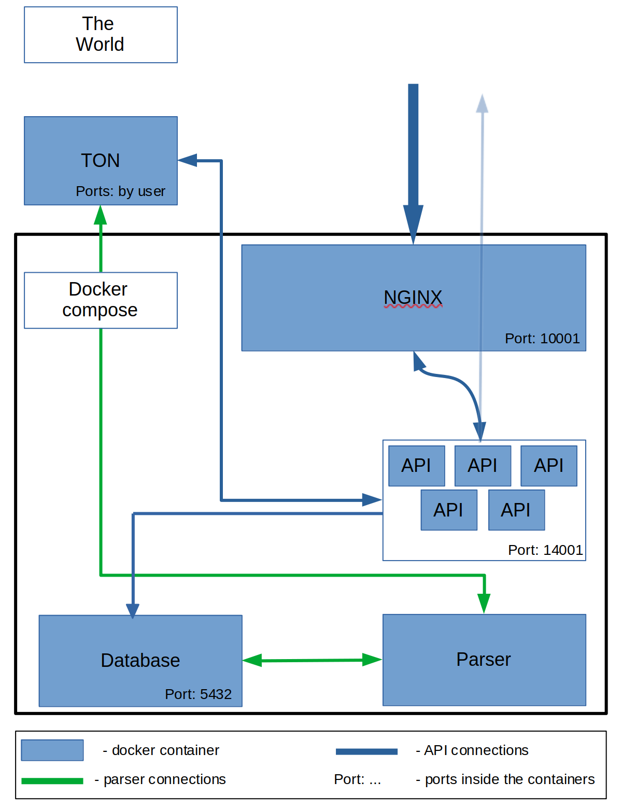

# Just start a docker compose magic

The task is simple:

Crate me 5 docker containers:  
1. Nginx
2. TON
3. TON API
4. Parser
5. Postgres

It was created a scheme of connections between containers in docker-compose: 



My first goal was to create a simple docker network using Nginx and API or Postgres(however, postgres will not use nginx). 
To realize it I wrote a docker compose file with build files (\<nameOfContainer>.Dockerfile). To start magic we should exec:

``` docker compose up --build ```

## Nginx part

It was created nginx.Dockerfile for building a Nginx image. It was used a simple nginx.conf (base) and there it was added a field in the http part 

`include /etc/nginx/sites-enabled/*.conf;`

After, a file was copied in image and additional files like api.conf and ton.conf was copied (all code can be find in nginx.Dockerfile). And after starting container all proxies ware allowed to use.

## Houston we have a problem

After all troubles with TON node we found that's there is no opportunities to start node in docker container with it own docker-network. So it's made a new plan:
1. Docker with host network and TON node (it's really work, I, [@jzethar](https://grizzly.cryptolization.com/jzethar), just tried)
2. Docker compose with API, Parser, Database, NGinx.

In this situation we gonna have a script with all commands how to build containers and start it.

## New start and it's ready

In my second attempt I made a docker container with TON that looks out from the network (host) and a docker compose file with NGinx, API, parser and DB. And only NGinx has outdoor port for connecting with API and all communication between API and others is going throw NGinx (accept node-API, look at the picture). Also in addition user can use a special port for DB to connect to it. 

All environmental variables can be set in the ton.env file (all can be seen in:  [ton_example.env](./ton_example.env)).

In addition there are start.sh and stop.sh - thees scripts can help to configure and start/stop docker.

