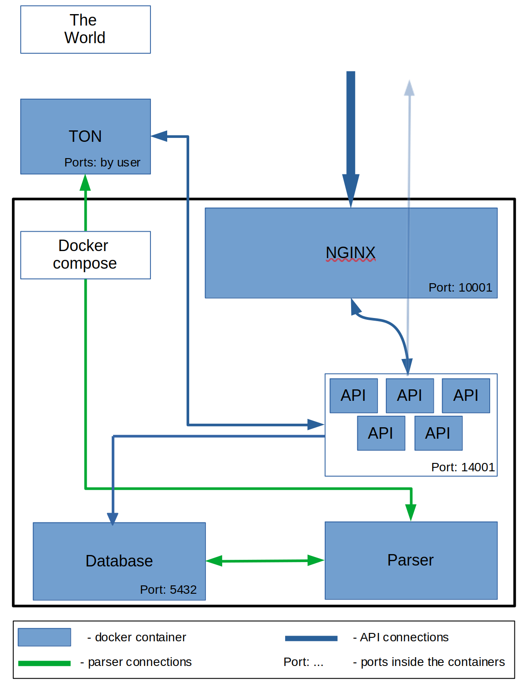

# What is it
It is a compilation of Docker compose files for starting TON node, API, database, indexer and NGinx. 

# Structure of the project
In this project ton-compose file deploys a TON node on the host network. Other applications are deploying by docker-compose file that will be generated during deploying. 

The scheme of connections between containers: 



# Starting
Before start you should write in the ton.env file all config params for a project and style it without backspaces. After that you can start building and deploying project:

`./start.sh`

This will firstly build TON project and put it in different containers. The TON node will start first because we need public keys to connect.

# Ending
If you need to stop Docker containers you can simply print:

`./stop.sh`

**_Attention_**: this will delete all volumes with collected data! If you don't need to delete it, just execute:

``` bash
docker-compose -f "ton-compose.yaml" down && \
docker-compose -f "docker-compose.yaml" down
```

# License

See [LICENSE.md](LICENSE.md) for more information.

By contributing to this repository, you agree to license your work under the MIT license unless specified otherwise at the top of the file itself. Any work contributed where you are not the original author must contain its license header with the original author and source.
